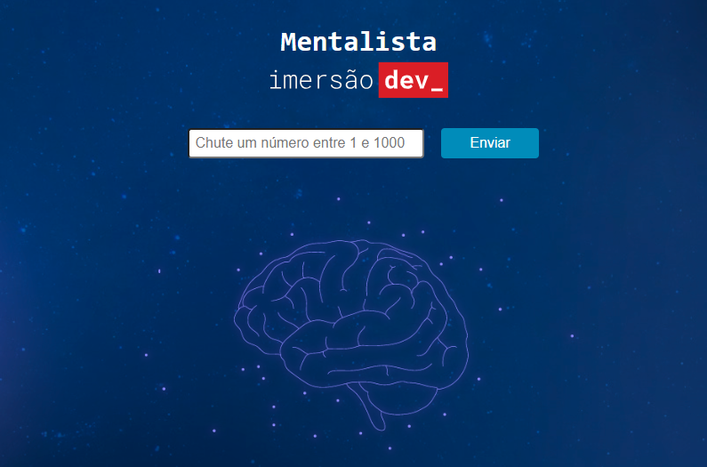

<h1 align="center"> Guessing Game - Alura's Immersion Dev 7 💵💰 </h1>

# 📃 About 
This guessing game was developed during Alura's Dev Immersion 7, during which I made several significant improvements. Among the enhancements implemented, I added a field on the page where the user can enter their guess along with a button to submit it. The user is prohibited from entering the number zero or any non-numeric input, and they receive hints as to whether the secret number is greater or smaller than the one they provided. If the randomly chosen number is odd, the user gets 10 chances to guess, whereas if it's even, they have 15 chances.

# 🔍 Live test 
Feel free to test the converter by clicking this [link](https://evertonab28.github.io/guessingGame/)

# 💻 View of interface

  

# 🔗 Technologies
☑️ HTML and CSS
☑️ JavaScript